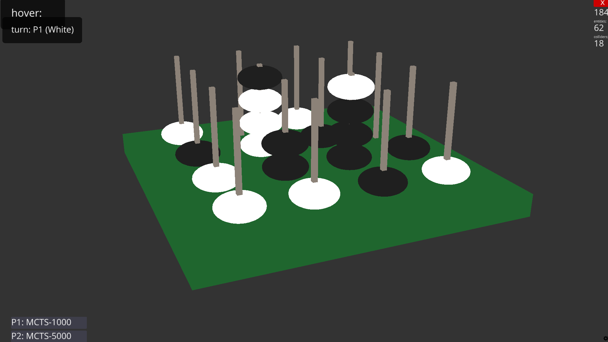

# Connect Four 3D

A 4×4×4 Connect Four game with bitboard engine, MCTS AI, and 3D rendering via Ursina.



## Project structure

```
agents.py          Agent interface + Random, MCTS, Neural agents.
arena.py           Headless match runner + round-robin tournament + Glicko-2 ratings.
engine.py          Pure game logic — Board, Game, win masks. Zero dependencies.
generate_data.py   MCTS self-play data generator (outputs .npz).
glicko2.py         Glicko-2 rating system (Glickman 2013). Zero dependencies.
main.py            Ursina 3D renderer with agent selection + live eval bar.
neural_model.pt    Trained MLP neural agent.
ratings.json       Persisted ratings (auto-generated by tournament mode).
test_engine.py     Smoke tests for the engine.
train_neural.py    Neural agent training: behavioral cloning, DAgger, RL fine-tuning.
training_data.npz  Training data generated by MCTS self-play, links game states to expert moves.
```

## Requirements

```
pip install ursina              # 3D renderer (only needed for main.py)
pip install torch numpy         # neural agent training (only needed for train_neural.py)
```

The engine, MCTS agents, arena, and Glicko-2 run on pure Python 3.10+ with no dependencies.
PyTorch is only needed for training and running the neural agent.

## Quick start

### Play the game

```bash
python main.py
```

Controls:
- **Left-click** — place a piece (human turns only)
- **Right-drag** — orbit camera
- **Scroll** — zoom in/out
- **Z** — undo last move
- **R** — reset the board

### Agent selection (in-game)

Two buttons in the bottom-left corner let you cycle each player through:

```
Human → Random → MCTS-1k → MCTS-5k → Neural
```

The Neural option appears automatically once `neural_model.pt` exists.
You can swap agents mid-game. Set both to AI and watch them play.
Set P1 to Human and P2 to MCTS-5k for a challenge (I can barely draw against it).

### Live eval bar

A position evaluation bar updates after every move, showing win probability
for each side. It runs 300 random rollouts from the current position (~5ms)
and converts to an advantage score: `+240` means White is winning ~80% of
random playouts. The bar shifts visually — watch it swing when someone
blunders or sets up a fork.

### Run the arena (headless)

```bash
python arena.py                                    # show usage
```

**Head-to-head match** (color-alternated):

```bash
python arena.py <agent1> <agent2> [n_games]
```

**Round-robin tournament** with Glicko-2 ratings:

```bash
python arena.py tournament [-n N] [agent1 agent2 ...]
```

**Show leaderboard**:

```bash
python arena.py ratings
```

Available agents: `random`, `mcts-1k`, `mcts-2k`, `mcts-5k`, `neural` (if trained), `neural-v2` (if trained)

Examples:

```bash
# Random vs Random, 200 games (100 each side)
python arena.py random random 200

# MCTS-1000 vs Random, 50 games
python arena.py mcts-1k random 50

# Tournament: specific agents, 20 games per pair
python arena.py tournament -n 20 random mcts-1k mcts-2k

# Tournament: all agents (default 20 games/pair)
python arena.py tournament

# View current ratings
python arena.py ratings
```

All matchups alternate colors: even-indexed games play normally, odd-indexed
games swap who goes first. This cancels first-player advantage (~55% for P1
at random level). We can say that this is pretty much a solved game, as before implementing alternating colors, the first player won more than 65% of the time even with random play, and running the mcts agents yielded even higher win rates for the first player. With alternating colors, the win rates for random play are much closer to 50/50, and the stronger agents still show a significant edge over random regardless of who goes first.

### Run engine tests

```bash
python test_engine.py
```

## Engine details

- **Board**: two `uint64` bitboards (one per player) on a 4×4×4 grid
- **Bit index**: `x + 4*y + 16*z` where x, y, z each range 0..3
- **Peg id**: `x + 4*y` (the column, 0..15) — pieces stack along z
- **Win detection**: 76 precomputed bitmasks, checked via `(bitboard & mask) == mask`
- **Win lines**: 48 axis-aligned + 24 face diagonals + 4 space diagonals = 76

## Agent details

| Agent | Description | Speed (approx.) |
|-------|-------------|-----------------|
| Human | Controlled via the UI | — |
| Random | Uniform random legal move | instant |
| MCTS-1k | UCT, 1000 iterations, random rollouts | ~100ms/move |
| MCTS-5k | UCT, 5000 iterations, random rollouts | ~500ms/move |
| Neural | MLP policy network (128→256→256→16), trained via DAgger + RL | ~0.1ms/move |
| NeuralV2 | 3D CNN policy network (2×4×4×4 input, Conv3d), trained via DAgger + RL | ~0.5ms/move |

MCTS uses Upper Confidence bounds for Trees (UCB1) with exploration constant c=√2.
No heuristic evaluation — pure win/loss/draw signal from terminal states.
Move selection: most-visited child (robust selection).

The neural agents use a canonical board encoding (128 binary features: current
player's pieces + opponent's pieces) so they learn to play from either side.

**Neural (v1, MLP)**: flat MLP with dropout. Fast but has no spatial awareness —
sees the board as a bag of bits. Reaches ~MCTS-300 strength.

**NeuralV2 (3D CNN)**: treats the board as its natural 2×4×4×4 tensor. Three
Conv3d layers (32→64→128 channels) with batch normalization learn spatial
patterns (lines, forks, threats) that the MLP cannot. Global average pooling
feeds into a small FC head.

## Benchmark results

```
Random vs Random    (100k games):  55.2%-44.8%-0.005%  — first-player edge
MCTS-1k vs Random    (100 games):  100-0-0             — total domination
MCTS-2k vs MCTS-1k   (20 games):   13-7-0             — more iterations = stronger
MCTS-5k vs MCTS-1k   (10 games):    8-2-0             — scaling holds
Neural vs Random      (50 games):   50-0-0             — 50 games in 0.1s
Neural vs MCTS-1k     (50 games):   16-34-0            — ~MCTS-300 equivalent
```

Current leaderboard:

```
────────────────────────────────────────────────────
  Rank  Agent           Rating     RD  Games
────────────────────────────────────────────────────
     1  mcts-5k         1895.6   50.0    115
     2  mcts-2k         1709.1   37.9    175
     3  mcts-1k         1610.1   36.7    175
     4  neural          1483.6   37.9    160
     5  neural-v2       1230.3   43.9    100
     6  random           828.5   63.9    175
────────────────────────────────────────────────────
```

## Glicko-2 ratings

Tournament mode runs round-robin matchups with color alternation and
updates ratings using the Glicko-2 system (Glickman 2013).

Example leaderboard after a 3-agent tournament (10 games/pair):

```
Rank  Agent           Rating     RD  Games
   1  mcts-2k         1827.5  110.2     20
   2  mcts-1k         1640.4  110.2     20
   3  random          1032.2  110.2     20
```

Ratings persist in `ratings.json`. Running more tournaments narrows RD
(rating deviation = confidence). New agents start at 1500/350 and
converge within a few tournaments.

Key parameters (in `glicko2.py`):
- **τ = 0.5** — volatility constraint (Glickman recommends 0.3–1.2)
- **Base rating** — 1500, **Base RD** — 350

## Neural agent training pipeline

Three-stage pipeline to train neural agents. Supports two architectures:
- `--arch mlp` (v1, default) — flat MLP, saves to `neural_model.pt`
- `--arch cnn` (v2) — 3D CNN, saves to `neural_v2_model.pt`

Both use the same training data and pipeline. The `--arch` flag goes
before the stage subcommand.

### Stage 1: Generate expert data

```bash
# Run MCTS self-play, saving (state, move, result) triples
python generate_data.py --games 1000 --iters 1000 --output training_data.npz
```

Each game produces ~30 training examples (one per move). 1000 games ≈ 30k samples.
D4 symmetry augmentation expands this 8x during training (~240k effective samples).

### Stage 2: Behavioral cloning

```bash
# Train MLP (v1)
python train_neural.py bc --data training_data.npz --epochs 100

# Train 3D CNN (v2)
python train_neural.py --arch cnn bc --data training_data.npz --epochs 100
```

### Stage 3: DAgger (distribution correction)

```bash
# MLP
python train_neural.py dagger --rounds 2 --games 100

# 3D CNN
python train_neural.py --arch cnn dagger --rounds 2 --games 100
```

### Stage 4: RL fine-tuning (curriculum learning)

```bash
# MLP
python train_neural.py rl --games 1000

# 3D CNN
python train_neural.py --arch cnn rl --games 1000
```

RL uses curriculum learning: starts against MCTS-50, advances to stronger
opponents as rolling win rate exceeds the threshold for each level. This
prevents policy collapse from training against an opponent that's too strong.

Features: baseline subtraction (reduces gradient variance), gradient clipping,
best-model checkpointing (only saves when rolling win rate improves), automatic
rollback if RL doesn't help.

The pre-RL model is backed up to `*_pre_rl.pt` in case you want to restart
RL with different hyperparameters.

### Evaluate

```bash
# Head-to-head
python arena.py neural-v2 mcts-5k 50

# Full tournament
python arena.py tournament -n 20 random neural neural-v2 mcts-1k mcts-2k
```

```
────────────────────────────────────────────────────
  Rank  Agent           Rating     RD  Games
────────────────────────────────────────────────────
     1  mcts-5k         1895.6   50.0    115
     2  mcts-2k         1709.1   37.9    175
     3  mcts-1k         1610.1   36.7    175
     4  neural          1483.6   37.9    160
     5  neural-v2       1230.3   43.9    100
     6  random           828.5   63.9    175
────────────────────────────────────────────────────
```

## Roadmap

- [x] Glicko-2 rating system
- [x] Live position eval bar
- [x] Neural agent v1 (MLP, DAgger + RL) — ~1415 ELO
- [x] Neural agent v2 (3D CNN, DAgger + RL)
- [ ] AlphaZero agent (value+policy heads, MCTS-guided training)
- [ ] Heuristic-enhanced MCTS (threat counting, center bias)
- [ ] Arena tournament mode: incremental (add new agent, play vs existing)
- [ ] Rating history tracking / convergence plots